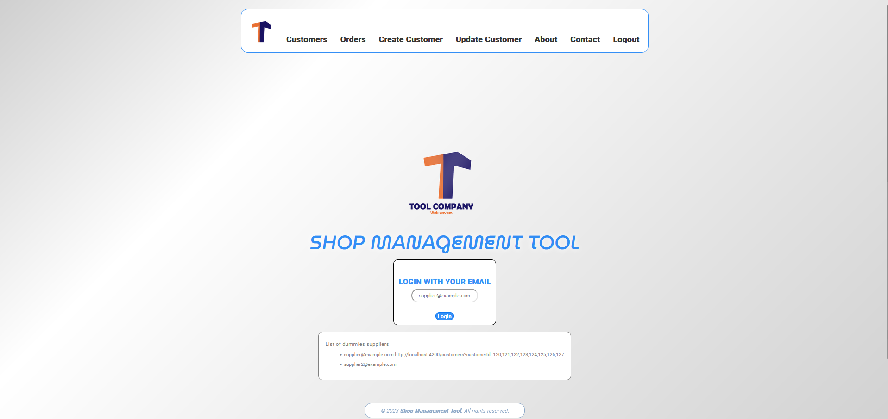
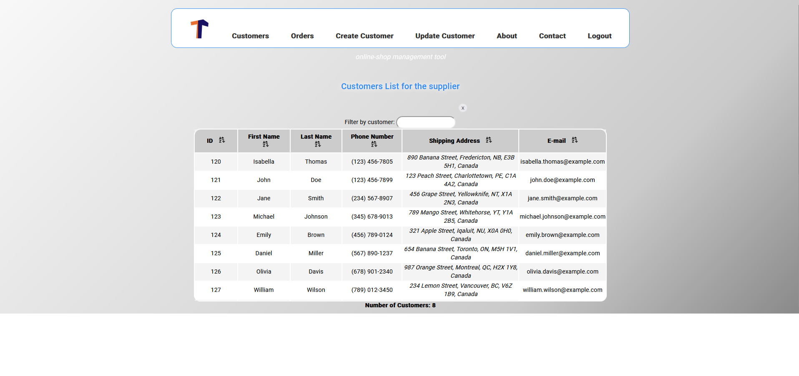
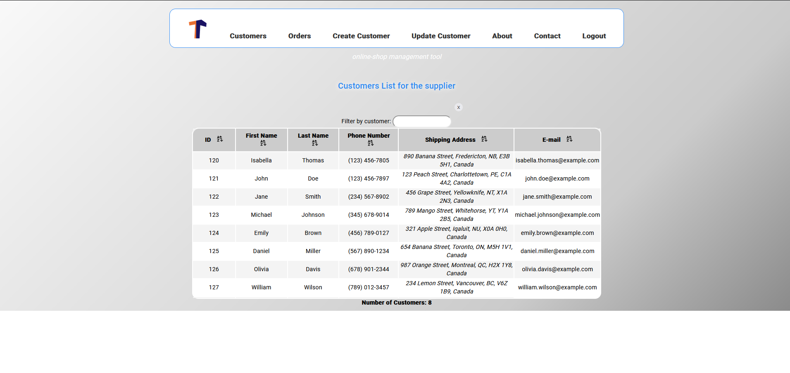
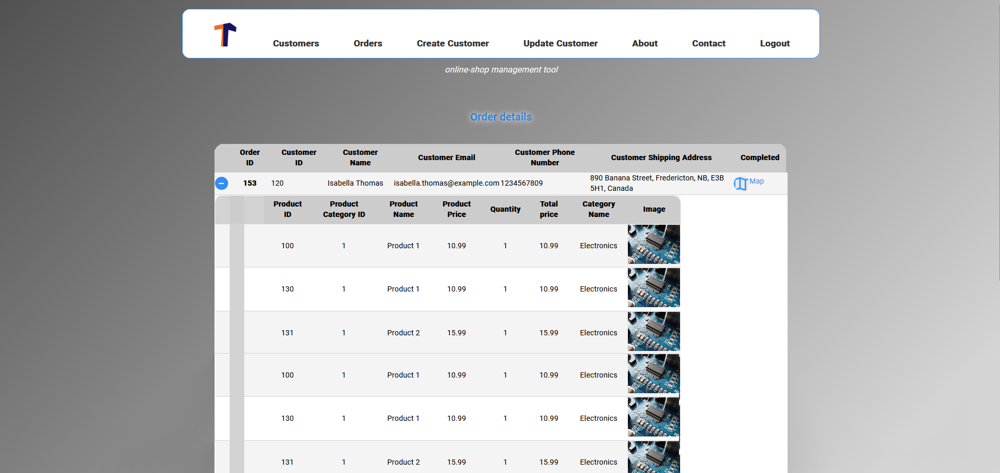
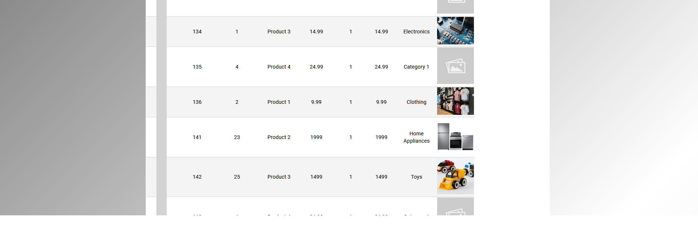
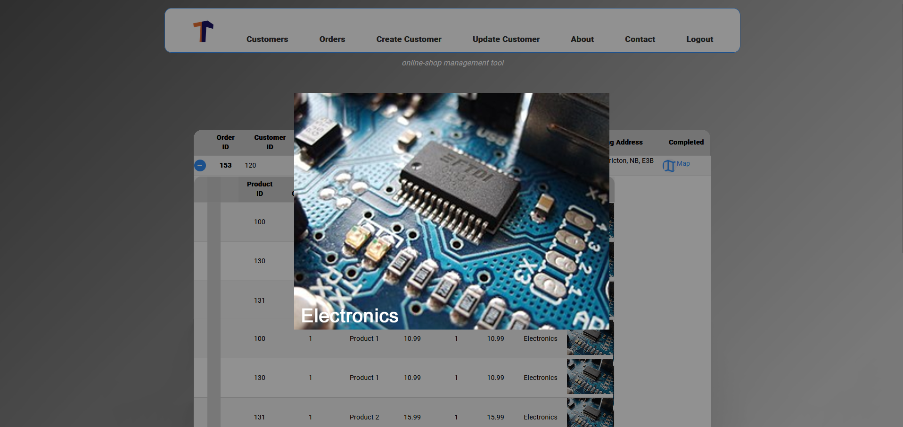
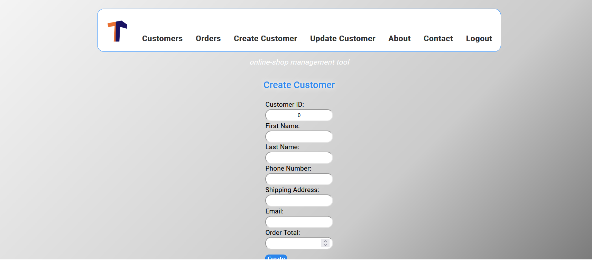
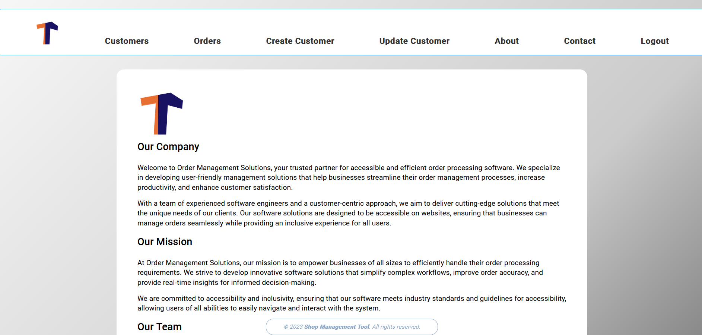
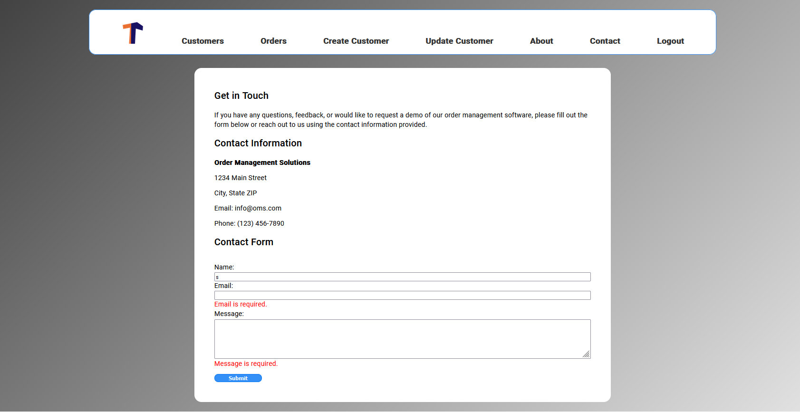
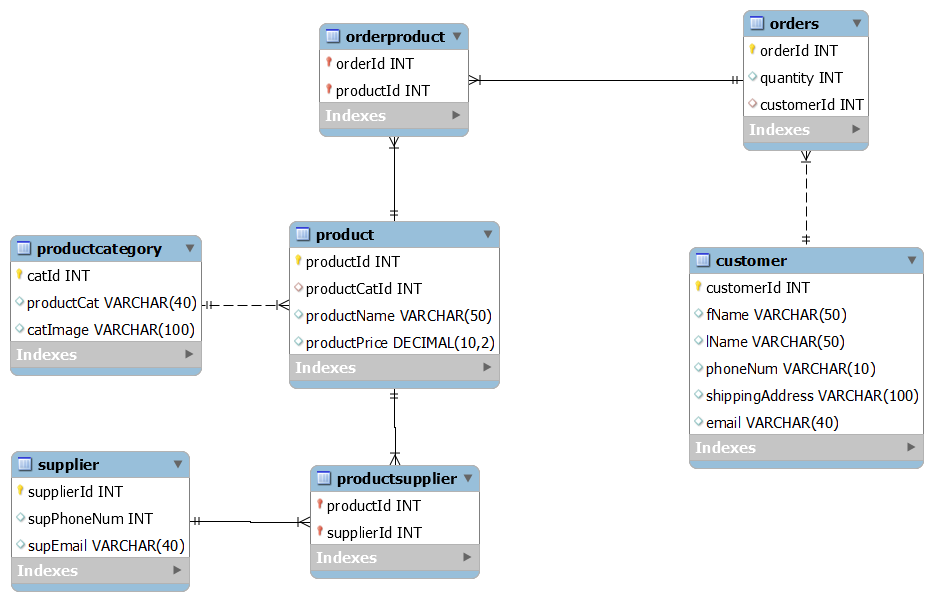

# Enterprise customer and orders tool

## Description

Shop is a comprehensive platform designed to help entrepreneurs manage their sales activities. The application allows users to keep track of customers and their orders, providing a seamless experience for managing business operations.

## Features

- **Customer Management:** Easily add, edit, and view customer information.
- **Order Tracking:** Record and manage customer orders efficiently.
- **Database Storage:** Utilizes an SQL database to store customer and order data securely.
- **Frontend (Angular):** User-friendly interface built with Angular CLI (version 16.0.0) for a responsive and dynamic user experience.
- **Backend (Java Spring):** Robust backend powered by Java Spring for handling data operations.

## Technologies Used

- **Frontend:**
    - Angular CLI (version 16.0.0)

- **Backend:**
    - Java Spring

- **Database:**
    - SQL
      

## Development server

Run `ng serve` for a dev server. Navigate to `http://localhost:4200/`. The application will automatically reload if you change any of the source files.

## Code Scaffolding

Run `ng generate component component-name` to generate a new component. You can also use `ng generate directive|pipe|service|class|guard|interface|enum|module`.

## Build

Run `ng build` to build the project. The build artifacts will be stored in the `dist/` directory.

## Running Unit Tests

Run `ng test` to execute the unit tests via [Karma](https://karma-runner.github.io).

## Installation

cd frontend
npm install

npm install -g @angular/cli

npx ng serve

cd backend
start mySQL database 'shopping cart' local instance
run App.java (port8080)

# Additional backend setup steps (e.g., database configuration) if necessary

Database Setup:

    Create an SQL database and configure the application to connect to it.

Run the Application:

bash

    # Start the backend server
    cd backend
    ./mvnw spring-boot:run

    # Start the frontend
    cd frontend
    ng serve

    Access the Application:
        Open your browser and navigate to http://localhost:4200 to use the application.

Configuration

    Backend Configuration:
        Update the backend configuration files as needed, including database connection details.

    Frontend Configuration:
        Adjust frontend environment files for configuration settings.
